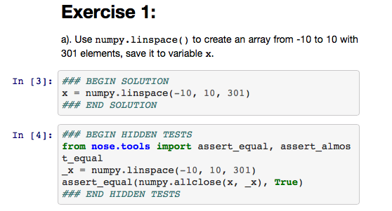
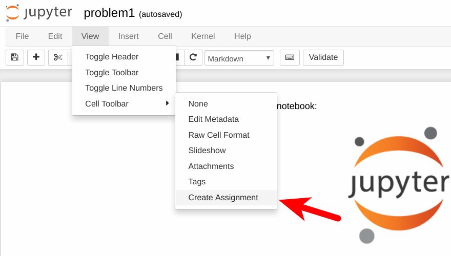

# Tutorial Speakers Guide

by **Lorena A. Barba**, JupyterCon 2020 General Chair

## General design

Each tutorial consists of several short pre-recorded videos (<30min each), plus written materials to supplement and expand on the presentations, provided as Jupyter notebooks in the tutorial repository. 

During the tutorials week of JupyterCon (5–9 October 2020), pre-recorded videos will air on YouTube Premiere at scheduled times, and tutorial instructors will participate in live discussion with the participants via video conference, also at scheduled times. 
Threaded text chat will be available throughout for all participants and instructors to engage in conversation asynchronously.
All the videos will remain for on-demand viewing in the JupyterCon YouTube channel after their release.

JupyterCon will build an online course with the materials provided by the instructors, which will remain available after the conference. 
The instructors' content is always open access and free: videos on the JupyterCon YouTube channel, and notebooks in a GitHub repository (under standard public licenses). 
To access the learning sequences on the course platform, however, participants need to be registered. 

The written materials must be on Jupyter notebooks because the course building process pulls content directly from notebooks in a GitHub repository to display a learning sequence in the online course platform.

## Speaker commitment:
The speakers will deliver their prepared materials by **September 11, 2020**, for the JupyterCon team to prepare an online course using the materials, on the JupyterCon learning platform. 
The materials should include an outline that traces a path through the content, with signposts of where each video and other elements (like exercises) should go.
Speakers will hold “office hours” or "recitations" on a video conference with participants during the tutorials week (5–9 October). 
Speakers are requested to participate in the chat discussions during the tutorials and conference weeks, as their time permits.

## JupyterCon commitment: 
JupyterCon and NumFOCUS volunteers and staff will build the online courses using instructor-created materials.
All source course material will be publicly available for free (videos on the JupyterCon YouTube channel and Jupyter notebooks on GitHub), but the online courses created in the JupyterCon platform will be accessible to registered participants only. The online course created with the contributed materials will remain after the conference is past, and may continue to be used as micro-learning offering by NumFOCUS. The course platform will embed a discussion forum, using a Mattermost instance provided by NumFOCUS/JupyterCon.

## Infrastructure

JupyterCon has deployed an ecosystem of tools and platforms to provide online learning experiences to all attendees. 
Tutorial instructors will be able to exploit these tools to make their content shine.

### Course platform

We've deployed a full-fledged online course platform, using the [Open edX software](https://open.edx.org/about-open-edx/). 
With speaker-provided materials (video and Jupyter notebooks), JupyterCon volunteers and NumFOCUS staff will build an online course. 
It can include quizzes and auto-graded "homework" exercises, to reinforce the partcipants' learning.

The course platform includes a custom extension that allows creating course content _from any publicly available Jupyter notebook_, using its URL. 
Pulling content from Jupyter notebooks allows us to build a learning sequence from the author-provided content, without duplication.

We also have a custom extension that allows writing exercises for the participants that are tested on-the-fly for correctness. 
This allows creating Jupyter-based "homework" assignments that are auto-graded in the platform.

### JupyterHub/MyBinder

JupyterCon will have a dedicated JupyterHub server that all participants will have access to. 
In addition, we've developed integrations so that it will be possible for tutorial attendees to launch a JupyterHub session with the notebooks provided by the instructor, so they can interact with the computable content. 

In your outline, you can specify places in the course content where you want learners to find a "Launch Lab" button, which will launch a Jupyter session with your notebooks pre-loaded. 
You need to provide an environment definition in the repository, via a `requirements.txt` file.


### Chat server

[Mattermost](https://mattermost.com) is an open-source, self-hosted "Slack alternative." 
We have deployed a Mattermost server, and integrated it to the course platform via single-sign-on, providing a secure environment for all participants to hold text-based conversations throughout the conference, and beyond.


### Video conferencing

The online course platform also includes a custom plug-in that allows us to schedule video calls using our Webex account. 
Participants will be able to join he call with one click from the course.
This facility will be used for the daily "office hours" or "recitations" with tutorial instructors, scheduled in advance. 


## Guide to crafting your materials

### Jupyter notebooks

Your tutorial should be written as a set of Jupyter notebooks—at least three or four fully narranted notebooks—walking your reader through the complete path to achieve the learning objectives. 

Each Jupyter notebook is "one lesson" and will correspond to "one section" in the online course. 
Printed, it should be 10 to 20 pages, equivalent to 17 to 35 minutes reading time. 
The computational portions should be presented as worked-out examples, broken down into steps, and narrated. 

Because the Jupyter notebooks will be ingested into the content management system of the learning platform, to display learning sequences, it is _very important_ that you break up the notebook in sections and sub-sections. 
The section headings, marked by `#`, `##` and so on, will be used as delimiters in the learning sequence to display portions of your notebook. 
That way, the learning sequence can interleave content from the notebooks, videos, self-assessments (e.g., multiple choice quiz), graded Jupyter notebooks, video call schedulers, etc.

In other words, your Jupyter notebooks are like the "textbook," while a learning sequence mixes this content with other experiences or activities.

While we ask that you have a full draft of your notebooks by the delivery date (Sep. 11), you will be able to continue editing the notebooks on GitHub.
As long as you have provided an accurate outline, and you do not make changes to section and sub-section headings, the course building process can go on in parallel to your final edits.
The course learning sequences pull content _dynamically_ from the notebooks. 
To be specific: each time a participant visits a section in the course, the Jupyter viewer extension we added to the platform will pull the notebook from its public URL, run `nbconvert`, and display the HTML output.

Building online courses in this way allows us to have the full display richness of Jupyter notebooks: beautiful equations, embedded images in the markdown, syntax-highlighted code, plot outputs, etc. 

**Pro tip**: while you are writing your content as Jupyter notebooks, always _clear output_ before pushing to the repository.
This will facilitate diff-viewing and keep the repo smaller. 
Only push the notebooks with output once you feel they are done. 
If you later fix a typo or make a small edit to markdown cells, push the change without re-running the notebook.

### Videos

We will be working with a media company to provide speakers with support in their creation of high-quality pre-recorded videos. 
These videos can be content-dense, as the live interactions during tutorials week will allow for instructors to guide participants in their learning.
(Read the [tweet thread by @gregork](https://twitter.com/gregork/status/1291760045269508096) about online videos.)

Your videos can be recorded as a screencast of you live coding and narrating, a slide-based presentation, a camera capture of yourself explaining or narrating some concept, or a mix of all these. 
You can provide video segments and request our media team to post-process, as needed. 

All speakers will be offered a lapel microphone and halo lamp, to help them record quality video (we may choose the items and send you a link with a gift card, so you get the items shipped to you). 
NumFOCUS will prepare a streamlined workflow for you to deliver the raw video, and will send you written instructions.
In post-processing, we will improve audio, and may add an intro and credits in the end.
We will then post the video on the JupyterCon YouTube channel.

### Slides

If you will have any portions of your presentation using slides, you can include them in the repository. 
We strongly encourage the use of text-based source for slides, and provide a simple example in the `slides` folder, using Jupytext and Reveal. 
View the example at [https://jupytercon.github.io/tutorial2020/#/](https://jupytercon.github.io/tutorial2020/#/)

### Learner self-assessments

A good tutorial will provide several opportunities for learners to self-assess, and we ask instructors to build these into their tutorial. 
We request that you share the assessments with us privately (i.e., they should not be included in the public repository).

You can craft simple multiple-choice questions to supplement video or written content. In this case, please provide them to us in this markdown format, so we can embed them in the course:

```
>>Statement of the question <<

( ) wrong answer
(x) right answer
( ) wrong answer
( ) wrong answer

[Explanation]
A short explanation to help learner get it right next time.
[Explanation]
```

Open edX offers several [core problem types](https://edx.readthedocs.io/projects/open-edx-building-and-running-a-course/en/open-release-ironwood.master/exercises_tools/create_exercises_and_tools.html#core-problem-types), and we can accommodate any of these in your tutorial. 
Please discuss with us by emailing to: 
[jupytercon-tutorials@numfocus.org](mailto:jupytercon-tutorials@numfocus.org)

### Jupyter auto-graded notebooks

For the tutorial to be most effective, you should include exercises for the learners. 
These exercises, written as Jupyter notebooks, can be auto-graded in the course platform. 
For that, you need to write the exercises in a format that allows using `nbgrader` to create an assignment. 
We have developed an integration in the course platform that allows  running `nbgrader` in a container and checking the learner's assignment, at the click of a button.

Each exercise should be divided into incremental steps, and you provide the solution, and a test, usign the `nbgrader` annotations. 
See the [`nbgrader` documentation](https://nbgrader.readthedocs.io/en/stable/user_guide/creating_and_grading_assignments.html#autograded-answer-cells) for detailed instructions on how to insert an "Autograded answer" and an "Autograded test."

Here is an example: 



In the screenshot above, the solution is in cell 3. After we process the notebook, the code between the marks `### BEGIN SOLUTION` and `### END SOLUTION` will be replaced by a note to the learner to "write your code here." 

The tests in cell 4 will be hidden from the learner, but will be active and used to check the learners code against the correct answer.

Your assignment notebook should include all the needed `import` statements at the top, and you should include `nose` in the `requirements.txt` (as well as all other dependencies, with their versions).

You will need to [install](https://nbgrader.readthedocs.io/en/stable/user_guide/installation.html) the `nbgrader` Jupyter extension. 
You will only be using the "Create assignment tool," and do not need to follow the later steps to create a student's version of the assignment, as this will be done automatically on the platform.

Open the raw version of your assignment notebook in the environment where you installed `nbgrader`, and you should have the option shown in the screenshot below:



Select "Create Assignment." Every notebook cell should now have a selector to pick the cell type, as shown below:


Work down the notebook making a selection for every cell:

- "Read-only" for markdown cells with instructions, and cells with `import` commands that you don't want anyone to mess with.
- "Autograded answer" for code cells that contain the solutions.
- "Autograded test" for code cells that contain teh tests.

Save the notebook, and this is the version you should send to us. We will create a _private repository_ for all the assignment notebooks. 
Don't include them in the public tutorial repository.

**Pro Tip**: Use a rational naming convention for your tutorial assignment notebooks with a prefix for your tutorial, and a consecutive number for the assignment.

**We strongly encourage tutorials to be complemented by autograded exercises for participants.**
But we acknowledge that this is hard work for the tutorial speakers. 
Even if your core materials for the tutorial are requested by September 11, we will continue to receive the autograded exercises until the week before the tutorial starts!

The process of building learning sequences on the course platform using your videos and Jupyter notebooks is time consuming. 
Adding an assignment, however, is quick. 
(Remember to add `nose` to your `requirements.txt`.)